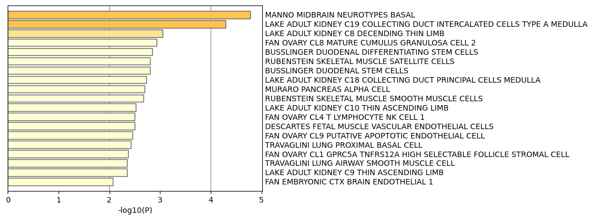

# Detection of Enriched Biological Functions
Group 34: Maxwell Mracek, Catherine Lian and Melissa Vu

# Background
The RNA-sequencing technique is used for the quantification and analysis of the gene expression of cells under varying conditions. Part of the RNA-seq pipeline is to conduct differential gene analysis on the mapped sequence reads. The quantification of differentially expressed is done utilizing tools such as DEseq2 and edgeR, which use a negative binomial distribution as their statistical methods. Differentially expressed genes are important to quantify as they will aid in our understanding of the biological functions and pathways affected by the varying conditions. By having a list of the differentially expressed genes, allows us to use gene annotation tools to detect the biological functions and pathways associated with each gene to then draw conclusions on the effects of each condition. Metascape is a popular gene annotation tool that creates useful visualizations of the differentially expressed gene data to aid in drawing accurate conclusions about each treatment.

# Detection of Biological Functions
Suppose that we are studying the immune response towards the influenza virus in humans. We will collect RNA-seq data to conduct differential expression analysis using DEseq2 to find which genes are associated with the immune response. After obtaining the list of differentially expressed genes, we will work to find and understand the biological functions and pathways these genes are associated with. To conduct this analysis, Metascape, a gene annotation website program will be utilized. Metascape will scan the list of differentially expressed genes and find the functions and protein pathways. It will form many graphs and interaction visualizations.

# Metascape Pipeline
Metascape uses a pipeline composed of four different steps. First it takes the inputted genes, and converts the gene IDs from whatever naming convention was used to Entrez Gene IDs. Next, it annotates the genes with associated ontological categories. Then there is the option for membership search, which allows the user to input terms and then labels genes associated with those terms. Finally, there is enrichment analysis, which analyzes which genes and ontological categories were significantly differentially expressed. 

To use Metascape, take a list of differentially expressed genes compiled in a .csv, .txt, or .xls format, insert the file into the “Input File” section of the website and run the analysis for humans. For this example, we will use the dataset from Brass et. al.[1] where human cells are treated with the influenza virus.

Screenshot of the Metascape input layout.
 
After conducting the Metascape analysis, many graphs and visuals should be provided on the website for further analysis. In Figure 1, the top 10 differentially expressed genes will be labeled along with their function. This provides a general overview of which functions are most impacted or utilized during an immune response to the influenza virus. We can utilize this figure to have a quick overview and idea of what is occurring in the cells. The gene with the highest p-value has the function of processing capped intron-containing pre-mRNA. This shows how the cells are undergoing DNA replication to produce proteins as an immune response to the influenza virus.

Figure 1. Top Differentially expressed genes with their respective function

Then we can look at Figure 2 that will group together genes with at least one protein interaction into a protein network. This will give a better understanding of how closely related these genes are to certain pathways. For example, according to Figure 2, our genes are mainly affecting pathways related to mRNA processing and transport as the network is mainly colored with red and blue nodes. The mRNA processing and transport pathways being impacted support the idea that the cells are undergoing a lot of DNA replication to produce proteins to fight the influenza virus in an immune response.

Figure 2. Protein-protein Interaction network for the differential genes

We can take a look at Figures 3-8, to see the quality control and association analysis of our genelist. Enrichment analysis for COVID, Cell Type Signatures, DisGeNET, TRRUST, and Transcription Factor Targets, respectively. For all enrichment analyses, the input gene list is compared to the gene lists from each database. The graphs show the gene lists where the input gene list showed the most statistically significant expression. Figure 4 includes a data table with statistics for each gene list, and it includes information on the counts and percentage of the input gene list that was expressed, along with p-values for the results. This provides a more in-depth analysis of what is occurring in the cells with the use of a visual. 

Figure 3, 4. Summary of enrichment analysis in COVID

Figure 5. Summary of enrichment analysis in Cell Type Signatures

Figure 6. Summary of enrichment analysis in DisGeNET

Figure 7. Summary of enrichment analysis in TRRUST

Figure 8. Summary of enrichment analysis in Transcription Factor Targets.

Overall, the Metascape gene annotation tool allows us to visualize and better understand the results of our collected data. For this example, we found that many of the differentially expressed genes in our cells treated with the influenza virus have biological functions related to pathways involving mRNA processing and cellular transport. This helps us understand what pathways are impacted by the virus and we can use this knowledge to shift our focus to these pathways and processes for further analysis. Metascape is a very useful tool to gain a better overview of detecting such biological functions and can aid in the direction of where we can focus our research for the future.

# Advantages of Metascape
Metascape uses an algorithm called MCODE to take the results from functional enrichment analysis and apply them to the identified protein-protein-interaction networks. This feature is an advantage over other analysis tools, as they usually are only able to show the statistical significance of the PPI networks, but not their functions. Another advantage is the output of a single list with gene list candidates, which allows for more efficient searches for gene annotation and membership.

# Disadvantages of Metascape
Disadvantages of Metascape include errors in finding database hits and predicting function. In addition, there is usually limited information on confidence in the output results.

# Other Tools
Aside from Metascape, DAVID is another popular gene annotation tool that will also detect biological functions associated with the input gene list and provide useful visualizations.

# References
Zhou, Y., Zhou, B., Pache, L., Chang, M. W., Khodabakhshi, A. H., Tanaseichuk, O., Benner, C., & Chanda, S. K. (2019). Metascape provides a biologist-oriented resource for the analysis of systems-level datasets. Nature Communications, 10(1). https://doi.org/10.1038/s41467-019-09234-6

Koonin, E. V. (2003). Genome annotation and analysis. Sequence - Evolution - Function - NCBI Bookshelf. https://www.ncbi.nlm.nih.gov/books/NBK20253/

Metascape. (n.d.). https://metascape.org/gp/index.html#/main/step1

Kukurba, K. R., & Montgomery, S. B. (2015). RNA sequencing and analysis. CSH Protocols, 2015(11), pdb.top084970. https://doi.org/10.1101/pdb.top084970

Metascape. (n.d.-b). Metascape Blog | A gene Annotation & analysis resource. https://metascape.org/blog/#:~:text=Metascape%20provides%20a%20rather%20unique,can%20say%20about%20such%20networks.

