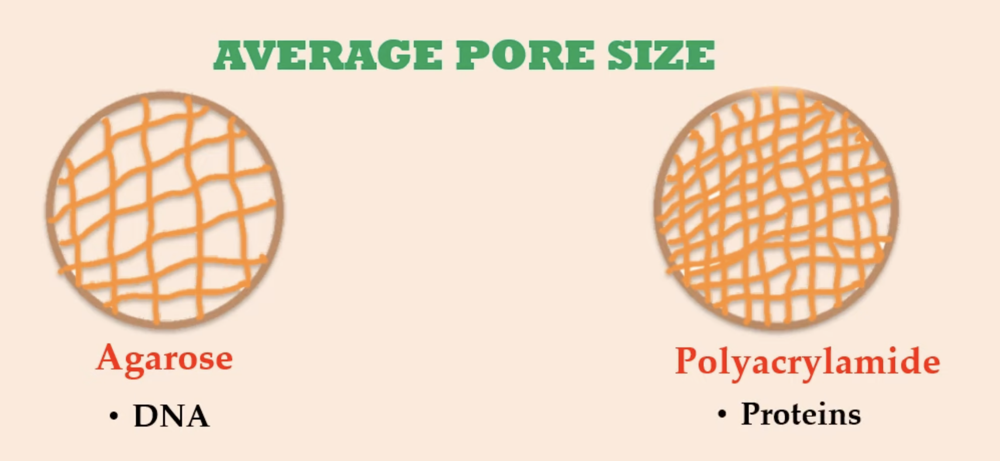
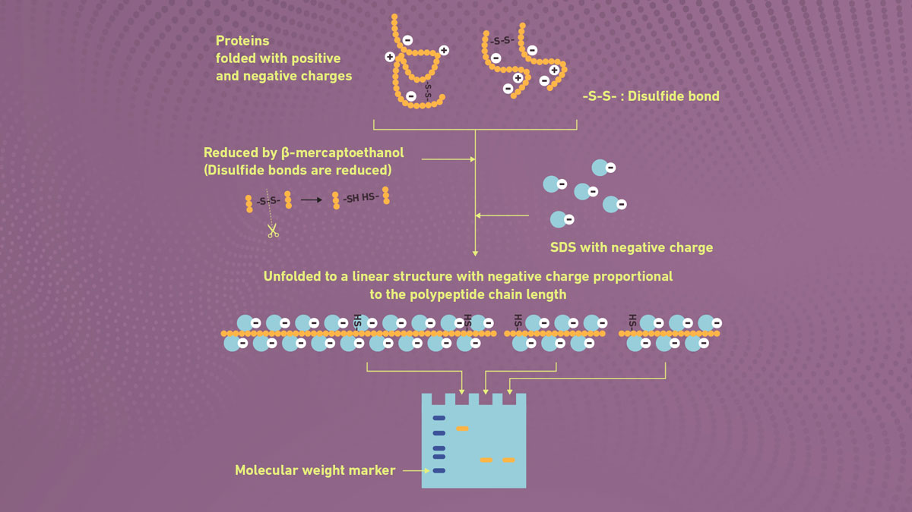
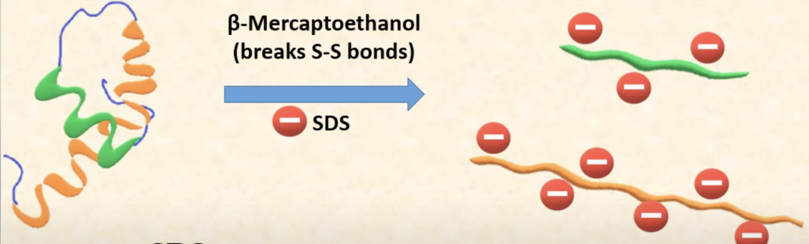
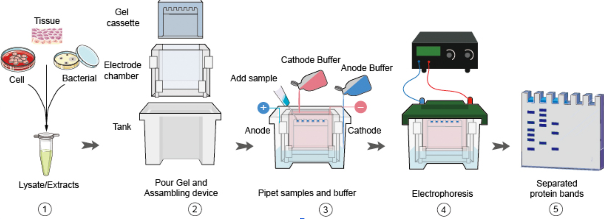
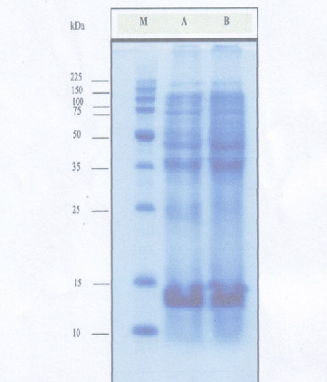
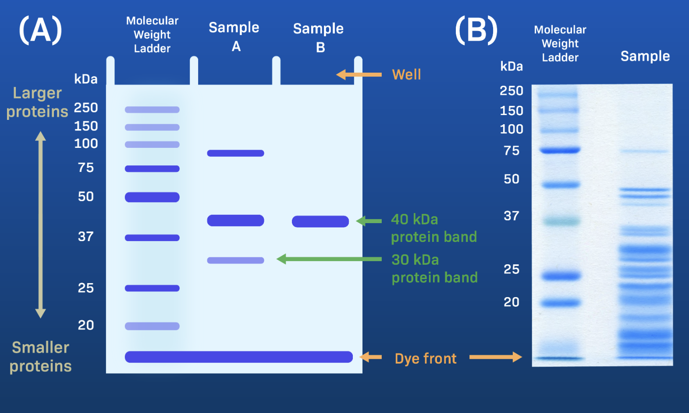

# PAGE (Polyacrylamide Gel Electrophoresis)

1. [Introduction](#231)  
   1.1 [Charge Density](#2311) 
   1.2 [Size and Shape](#2312)
3. [Native PAGE vs SDS PAGE](#232)  
   2.1. [Native PAGE](#2321)  
   2.2. [SDS PAGE](#2322)
4. [Procedure of SDS](#235)
5. [Interpretation](#233)
6. [Applications](#234)

## 1. Introduction 

Polyacrylamide Gel Electrophoresis(PAGE) is a technique that separates macromolecules based on their electrophoretic mobility. Electrophoretic mobility is the ability of analytes to move towards an electrode of the opposite charge.<a href="https://www.technologynetworks.com/analysis/articles/polyacrylamide-gel-electrophoresis-how-it-works-technique-variants-and-its-applications-359100#D1.">[1]

Compared to agarose gel which can also be used for electrophoresis, acrylamide gel is used for smaller molecules like proteins and nucleic acids because it has smaller pores[Figure1]. The separation of proteins in PAGE depends on the:
- Charge Density (Charge-to-mass ratio)
- Size and shape 

Figure 1

#### 1) Charge Density  

Proteins are composed of amino acids. Each of these amino acids carries charge, either positive or negative; some of them has no charge. Because of the charges that amino acids carry, proteins can have an overall charge. The pH of surroundings of the protein also affects the net charge of a protein. <a href="https://www.youtube.com/watch?v=5obiHqeYEc0">[2]

In electrophoresis, pH of the buffer is set at a value such that all proteins at that pH will carry negative net charge. Proteins being negatively charged, then will migrate to anode (positive electrode) through electrophoresis. [Figure 2]

- higher charge density migrates faster in the gel (green)
- lower charge density migrates slower in the gel (blue)
 

Figure 2

#### 2) Size and Shape 

Size: number of amino acid residues in a protein

- larger in size, slower in migration
- smaller in size, faster in migration

Shape: 

- globular proteins migrate faster
- elongated proteins migrate slower 

The extent of cross-linking in the gel and average pore size also affects the migration of proteins of various shapes and sizes. 

## 2. Native PAGE vs SDS PAGE 

There are two ways to run PAGE depending on the purpose of the analysis. PAGE can be run under denaturing or non-denaturing conditions. 

#### 1) Native PAGE 

In Native PAGE, the disulfide bonds are undisturbed, preserving the protein’s overall structure. As a result, the positioning of proteins through the gel is mainly influenced by the protein’s charge and the pH of the separation rather than its size. It allows the analysis of their natural state if we want to analyze bound proteins or complexes. Compared to SDS, Native PAGE do not use reducing agents, heat, and lower voltages which can damage the protein's natural state. <a href="https://www.technologynetworks.com/analysis/articles/polyacrylamide-gel-electrophoresis-how-it-works-technique-variants-and-its-applications-359100#D1.">[1]

#### 2) SDS PAGE 

To determine the molecular weights of proteins or whether the given protein is made up of single subunit or multiple subunits, we’ll have to run SDS PAGE. In SDS PAGE, sodium dodecyl sulphate, with heat and sometimes a reducing agent are used to denature proteins before electrophoretic separation. The heat breaks the hydrogen bonds and the reducing agent cleaves disulfide bridges. <a href="https://www.technologynetworks.com/analysis/articles/polyacrylamide-gel-electrophoresis-how-it-works-technique-variants-and-its-applications-359100#D1.">[1]

In Figure 3, we have proteins folded with positive and negative charges. Once you add the reducing agent, it cleaves the disulfide bond and unfolds the proteins. SDS with negative charge is then added to negate the charge density in proteins so that the proteins can be separated based on their molecular weight. The linearization of proteins and complex with SDS, as a result, cause the proteins to have similar charge density. With similar charge density, the proteins are then separated based on different molecular weight. 

Figure 3

Figure 4

The figure 4 shows that the protein is composed of two subunits. When the protein is treated with SDS molecule, its intact structure would get disrupted by attachment to negative charge of SDS. This leads to the protein denaturation and the mask of the original charges of amino acid by the coating. Now, having approximately same charge, density, shape, 'size' or 'molecular weight' would be the only parameter. 

## 3. Procedure of SDS 

Figure 5

<table>
 <tbody>
    <tr>
        <th>Steps</td>
        <th>Description</td>
    </tr>
    <tr>
        <td>Sample Preparation </a></td>
        <td><ul><li>Treat the protein for denaturation with SDS and beta-mercaptoethonol with heat</li><li>Coating of the original charge yields the similar charge, density, shape of the polypeptide chains</li><li>This helps the gel electrophoresis strictly based on the 'molecule weight' and 'size'</li></ul></td>
    </tr>
    <tr>
    <td>Gel Preparation </a></td>
    <td><ul><li>Requires BIS, acrylamide, and a buffer for the mixture of gel</li><li>This mixture prevent forming the bubble during the Gel electrophoresis process</li><li>Allows the separation of the proteins at the end by creating the gel matrix</li></ul></td>
    </tr>
    <tr>
    <td>Gel Electrophoresis </a></td>
    <td><ul><li>Protein migration occurs towards negative electrode by the electric current</li><li>Different rate of each molecule's migration indicates the molecule weight</li><li>Leads to the separation of protein molecule based on their size</li><li>The voltage strength controls the migration speed
</li></ul></td>
    </tr>
    <tr>
    <td>Staining and Visualization </a></td>
    <td><ul><li>The result of the gel electrophoresis can be detected by using the colored dye</li><li>Separated protein molecule stained in distinct color by tracking dye</li><li>Coomassie Brilliant or Blue or ehtidium bromide, major colored dye used, will be washed out if unbound</li></ul></td>
    </tr>
    <tr>
    <td>Analysis </a></td>
    <td><ul><li>Analysis of the protein band's color intensity will proceed by using autoradiography</li><li>Amout of the protein molecule is directly proportional to the color intensity, meaning the amount of the bound dye</li></ul></td>
    </tr>
 </tbody>
</table>

# 4. Interpretation 
Unlike agarose gel electrophoresis result which is only visible through UV light, PAGE gel is visible by the naked eye through the coomassie brilliant blue stained in polyacrylamide gels. To begin the interpretation of the PAGE gel, it is important to identify the marker ladder location. Marker ladders typically present most left or right lane of the gel. It is used to assist in determining the protein size that is present in the sample. Each band in the marker ladder is labeled with its corresponding size in kilodaltons (kDa), providing a reference to estimate the molecular weights of proteins in the sample. <a href="https://www.labxchange.org/library/items/lb:LabXchange:02a2a79b:html:1">[7]

Figure 6

In Figure 5, the marker ladder is present in the leftmost lane. Notice how the size of the band decreases as it reaches the bottom of the lane. This is consistent with the gel electrophoresis principle where smaller proteins migrate more rapidly than larger ones. As a result, the smaller size of the protein ends up at the bottom of the lane and the larger protein stays more toward the top of the lane.

Another crucial aspect in interpreting the PAGE gel is the difference in band strengths. The strength of a band directly reflects the quantity of the corresponding protein within the sample
It provides important information on the relative abundance of specific proteins. The stronger band indicates a higher presence of the corresponding proteins in the sample, while lighter bands suggest lower concentrations of that protein. <a href="https://www.labxchange.org/library/items/lb:LabXchange:02a2a79b:html:1">[7]

Figure 7

Looking at the gel representation in Figure 6, sample A has three bands at 30kDa, 40kDa, and 90kDa. Comparing the band strengths among three bands allows to interpret the relative protein quantities within the sample A. Notably, the 40 kDa protein band has the highest intensity, indicating a high abundance of the protein presented in the sample. Then, there are more 90kDa protein presented in the sample, followed by 30kDa protein being the least presented in the sample A. 

# 5. Applications 
   There are multiple PAGE applications analyzing the protein, including Western Blotting, Enzyme Zymography,Extraction for mass spectrometry, and Electrophoretic mobility shift assay. 
   
 <table>
 <tbody>
    <tr>
        <th>Applications</td>
        <th>Description</td>
    </tr>
    <tr>
        <td>Western Blotting <a href="https://pubmed.ncbi.nlm.nih.gov/21340897/">[3]</td>
        <td><ul><li>Used for specific antibody detection by transfering of the protein molecule from gel to memebrane</li><li>Identify significant traits of protein antigents based on its quanity, molecular weight, and presence</li><li>How effective the antigen could be extract could be measured</li></ul></td>
    </tr>
    <tr>
    <td>Enzyme Zymography <a href="https://pubmed.ncbi.nlm.nih.gov/28608218/">[4]</td>
    <td><ul><li>Overcomes challenge of analyzing the protease that traditional Zymography</li><li>Nonreducing SDS-PAGE addresses this limitation without engaging protein substrate</li><li>Having similar trend to Western Blotting, the band from electrophoresis leads to the proteomic analysis interpretation </li></ul></td>
    </tr>
    <tr>
    <td>Extraction for mass spectrometry <a href="https://pubmed.ncbi.nlm.nih.gov/9177686/">[5] </td>
    <td><ul><li>Analyze the chemical and molecular strucure by measuring the mass to charge ratio  </li><li> Protein bands produced by SDS-PAGE gel are excised</li><li>Destaining, and extraction of the protein follows as the procedure</li></ul></td>
    </tr>
    <tr>
    <td>Electrophoretic mobility shift assay <a href="https://www.ncbi.nlm.nih.gov/pmc/articles/PMC2757439/">[6]</td>
    <td><ul><li>Electrophoretic mobility shift assay(EMSA) is a technology to identify the nucleic acids within the protein complexes</li><li>Paired with PAGE due to its high performance of separation resolution and stability compared to agroase gel electrophoresis </li><li>SDS-PAGE is regarded as one of the most best tool for EMSA</li></ul></td>
    </tr>
 </tbody>
</table> 
       
# Reference

[1] Polyacrylamide Gel Electrophoresis, How It Works, Technique Variants and Its Applications | Technology Networks. (n.d.). Retrieved December 12, 2023, from https://www.technologynetworks.com/analysis/articles/polyacrylamide-gel-electrophoresis-how-it-works-technique-variants-and-its-applications-359100.

[2] “NATIVE PAGE.” YouTube, YouTube, 10 May 2019. Retrieved from December 13, 2023, from
https://www.youtube.com/watch?v=5obiHqeYEc0.

[3] Brooks, S. A., Schumacher, U., Blancher, C., & Jones, A. (n.d.). Western Blotting 145 145 SDS-PAGE and Western Blotting Techniques. From: Methods in Molecular Medicine, 57. https://pubmed.ncbi.nlm.nih.gov/21340897/.

[4] Pan, D., Wilson, K. A., & Tan-Wilson, A. (2017). Transfer Zymography. Methods in Molecular Biology (Clifton, N.J.), 1626, 253–269. https://doi.org/10.1007/978-1-4939-7111-4_24

[5] Cohen, S. L., & Chait, B. T. (1997). Mass spectrometry of whole proteins eluted from sodium dodecyl sulfate-polyacrylamide gel electrophoresis gels. Analytical Biochemistry, 247(2), 257–267. https://doi.org/10.1006/ABIO.1997.2072.

[6] Hellman, L. M., & Fried, M. G. (n.d.). Electrophoretic Mobility Shift Assay (EMSA) for Detecting Protein-Nucleic Acid Interactions. https://doi.org/10.1038/nprot.2007.249.

[7] How to Interpret Polyacrylamide Gels: The basics - LabXchange. (n.d.). Retrieved December 12, 2023, from https://www.labxchange.org/library/items/lb:LabXchange:02a2a79b:html:1.
