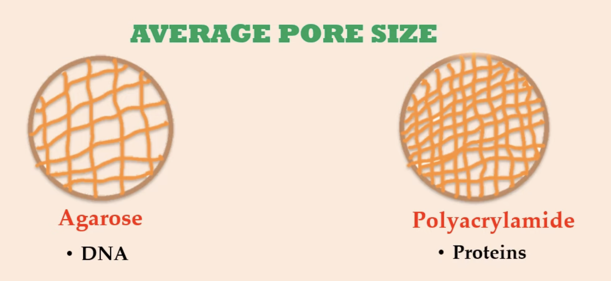
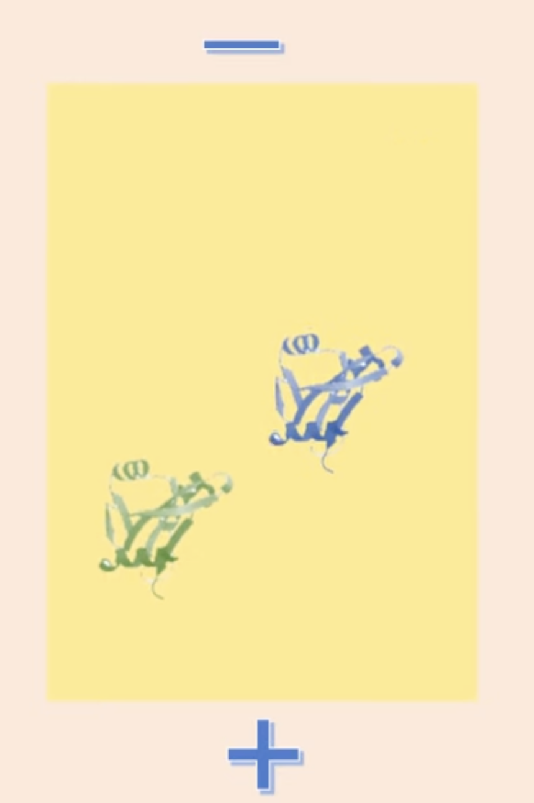
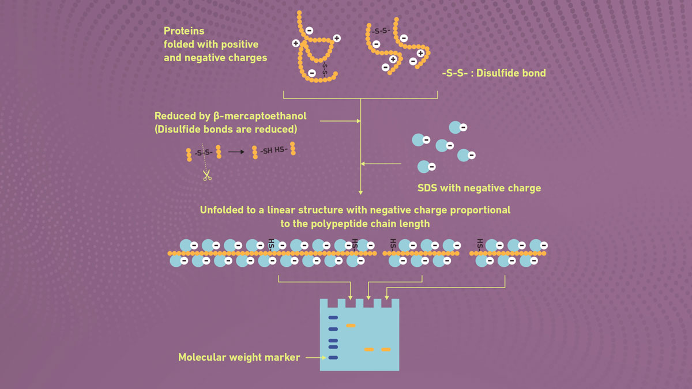
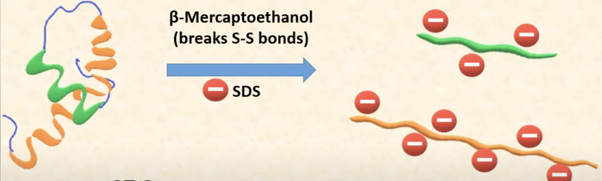
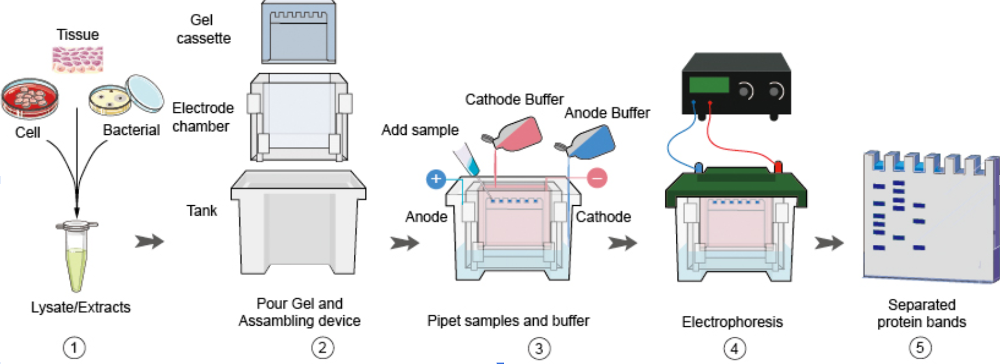

# PAGE (Polyacrylamide Gel Electrophoresis)

1. [Introduction](#231)  
   1.1 [Charge Density](#2311) 
   1.2 [Size and Shape](#2312)
3. [Native PAGE vs SDS PAGE](#232)  
   2.1. [Native PAGE](#2321)  
   2.2. [SDS PAGE](#2322)
4. [Procedure of SDS](#235)
5. [Interpretation](#233)
6. [Applications](#234)

## 1. Introduction 

Polyacrylamide Gel Electrophoresis(PAGE) is a technique that separates macromolecules based on their electrophoretic mobility which is the ability of analytes to move towards an electrode of the opposite charge. Compared to agarose gel which can also be used for electrophoresis, acrylamide gel is used for smaller molecules like proteins and nucleic acids because it has smaller pores[Figure1]. The separation of proteins in PAGE depends on the:
- Charge Density (Charge-to-mass ratio)
- Size and shape 

Figure 1

#### 1) Charge Density  

Proteins are composed of amino acids. Each of these amino acids carries charge, either positive or negative; some of them has no charge. Thus, because of the charges, proteins carry an overall charge (or net charge). Net charge of a protein depends on pH of its surroundings. 

In electrophoresis, pH of the buffer is set such that all proteins at that pH will carry negative net charge. Being negatively charged, they will migrate to anode (positive electrode). [Figure 2]

- higher charge density migrates faster in the gel (green)
- lower charge density migrates slower in the gel (blue)

Figure 2  

#### 2) Size and Shape 

Size: number of amino acid residues in a protein

- larger in size, slower in migration
- smaller in size, faster in migration

Shape: 

- globular proteins migrate faster
- elongated proteins migrate slower 

The extent of cross-linking in the gel and average pore size also affects the migration of proteins of various shapes and sizes. 

## 2. Native PAGE vs SDS PAGE 

There are two ways to run PAGE depending on the purpose of the analysis.

To better understand the difference between these methods, I'd like to distingush them between the following couple of aspects:

#### 1) Native PAGE 

In Native PAGE, the disulfide bonds are left intact, preserving the protein’s structure. Thus, the distribution of proteins through the gel is mainly influenced by the protein’s charge and the pH of the separation rather than its size. It allows the analysis of their natural state if we want to analyze bound proteins or complexes. 

#### 2) SDS PAGE 

To determine the molecular weights of proteins or whether the given protein is made up of single subunit or multiple subunits, we’ll have to run SDS PAGE. In SDS PAGE, sodium dodecyl sulphate, with heat and sometimes a reducing agent are used to denature proteins before electrophoretic separation. The heat breaks the hydrogen bonds and the reducing agent cleaves disulfide bridges. 

In Figure 3, we have proteins folded with positive and negative charges. Once you add the reducing agent, it cleaves the disulfide bond and unfolds the proteins. SDS with negative charge is then added to negate the charge density in proteins so that the proteins can be separated based on their molecular weight. The linearization of proteins and complex with SDS, as a result, cause the proteins to have similar charge density. 

Figure 3

The figure above shows that the protein is composed of two subunits. When the protein is treated with SDS molecule, its intact structure would get disrupted by attachment to negative chage of SDS. This leads to the protein denaturation and the mask of the original charges of amino acid by the coating. Now, having approximately same charge, density, shape, 'size' or 'molecular weight' would be the only paramter. [2].

## 3. Procedure of SDS 

<table>
 <tbody>
    <tr>
        <th>Steps</td>
        <th>Description</td>
    </tr>
    <tr>
        <td>Sample Preparation </a></td>
        <td><ul><li>Treat the protein for denaturation with SDS and beta-mercaptoethonol with heat</li><li>Coating of the original charge yields the similar charge, density, shape of the polypeptide chains</li><li>This helps the gel electrophoresis strictly based on the 'molecule weight' and 'size'</li></ul></td>
    </tr>
    <tr>
    <td>Gel Preparation </a></td>
    <td><ul><li>Requires BIS, acrylamide, and a buffer for the mixture of gel</li><li>This mixture prevent forming the bubble during the Gel electrophoresis process</li><li>Allows the separation of the proteins at the end by creating the gel matrix</li></ul></td>
    </tr>
    <tr>
    <td>Gel Electrophoresis </a></td>
    <td><ul><li>Protein migration occurs towards negative electrode by the electric current</li><li>Different rate of each molecule's migration indicates the molecule weight</li><li>Leads to the separation of protein molecule based on their size</li><li>The voltage strength controls the migration speed
</li></ul></td>
    </tr>
    <tr>
    <td>Staining and Visualization </a></td>
    <td><ul><li>The result of the gel electrophoresis can be detected by using the colored dye</li><li>Separated protein molecule stained in distinct color by tracking dye</li><li>Coomassie Brilliant or Blue or ehtidium bromide , major colored dye used, will be washed out if unbound</li></ul></td>
    </tr>
    <tr>
    <td>Analysis </a></td>
    <td><ul><li>Analysis of the protein band's color intensity will proceed by using autoradiography</li><li>Amout of the protein molecule is directly proportional to the color intensity, meaning the amount of the bound dye</li></ul></td>
    </tr>
 </tbody>
</table>

# 4. Interpretation 
Unlike agarose gel electrophoresis result which is only visible through UV light, PAGE gel is visible by the naked eye through the coomassie brilliant blue stained in polyacrylamide gels. 

To begin the interpretation of the PAGE gel, it is important to identify the marker ladder location. Marker ladders typically present most left or right lane of the gel. It is used to assist in determining the protein size that is present in the sample. Each band in the marker ladder is labeled with its corresponding size in kilodaltons (kDa), providing a reference to estimate the molecular weights of proteins in the sample. 

In the image above, the marker ladder is present in the left most lane. Notice how the size of the band is decreasing as reaching the bottom of the lane. This is consistent with the gel electrophoresis principle where smaller proteins migrate more rapidly than larger ones. As a result, the smaller the size of the protein ends up in the bottom of the lane and larger protein stay more toward the top of the lane.

# 5. Application 
   There are multiple PAGE applications analyzing the protein, including Western Blotting, Enzyme Zymography,Extraction for mass spectrometry, and Electrophoretic mobility shift assay. 
   
 <table>
 <tbody>
    <tr>
        <th>Applications</td>
        <th>Description</td>
    </tr>
    <tr>
        <td>Western Blotting </a></td>
        <td><ul><li>Treat the protein for denaturation with SDS and beta-mercaptoethonol with heat</li><li>Coating of the original charge yields the similar charge, density, shape of the polypeptide chains</li><li>This helps the gel electrophoresis strictly based on the 'molecule weight' and 'size'</li></ul></td>
    </tr>
    <tr>
    <td>Enzyme Zymography </a></td>
    <td><ul><li>Requires BIS, acrylamide, and a buffer for the mixture of gel</li><li>This mixture prevent forming the bubble during the Gel electrophoresis process</li><li>Allows the separation of the proteins at the end by creating the gel matrix</li></ul></td>
    </tr>
    <tr>
    <td>Extraction for mass spectrometry </a></td>
    <td><ul><li>Protein migration occurs towards negative electrode by the electric current</li><li>Different rate of each molecule's migration indicates the molecule weight</li><li>Leads to the separation of protein molecule based on their size</li><li>The voltage strength controls the migration speed
</li></ul></td>
    </tr>
    <tr>
    <td>Electrophoretic mobility shift assay </a></td>
    <td><ul><li>The result of the gel electrophoresis can be detected by using the colored dye</li><li>Separated protein molecule stained in distinct color by tracking dye</li><li>Coomassie Brilliant or Blue or ehtidium bromide , major colored dye used, will be washed out if unbound</li></ul></td>
    </tr>
 </tbody>
</table>  

# Referrence

[1] Schmitt, Anthony D., Ming Hu, and Bing Ren. "Genome-wide mapping and analysis of chromosome architecture." Nature reviews Molecular cell biology 17.12 (2016): 743. 

[2] Risca, Viviana I., and William J. Greenleaf. "Unraveling the 3D genome: genomics tools for multiscale exploration." Trends in Genetics 31.7 (2015): 357-372. 

[3] Dekker J, Rippe K, Dekker M, Kleckner N. Capturing chromosome conformation. Science 2002;295(5558):1306–11. 

[4] Simonis M, Klous P, Homminga I, Galjaard RJ, Rijkers EJ, Grosveld F, et al. High-res- olution identification of balanced and complex chromosomal rearrangements by 4C technology. Nature Methods 2009;6(11):837–42. 

[5] Dostie J, Richmond TA, Arnaout RA, Selzer RR, Lee WL, Honan TA, et al. Chromo- some Conformation Capture Carbon Copy (5C): a massively parallel solution for mapping interactions between genomic elements. Genome Res 2006;16(10): 1299–309. 

[6] Lieberman-Aiden E, van Berkum NL, Williams L, Imakaev M, Ragoczy T, Telling A, et al. Comprehensive mapping of long-range interactions reveals folding principles of the human genome. Science 2009;326(5950):289–93. 

[7] Fullwood, M.J. et al. (2009) An oestrogen-receptor-alpha-bound human chromatin interactome. Nature 462, 58–64. 

[8] https://github.com/hms-dbmi/hic-data-analysis-bootcamp/blob/master/HiC-Protocol.pptx.
