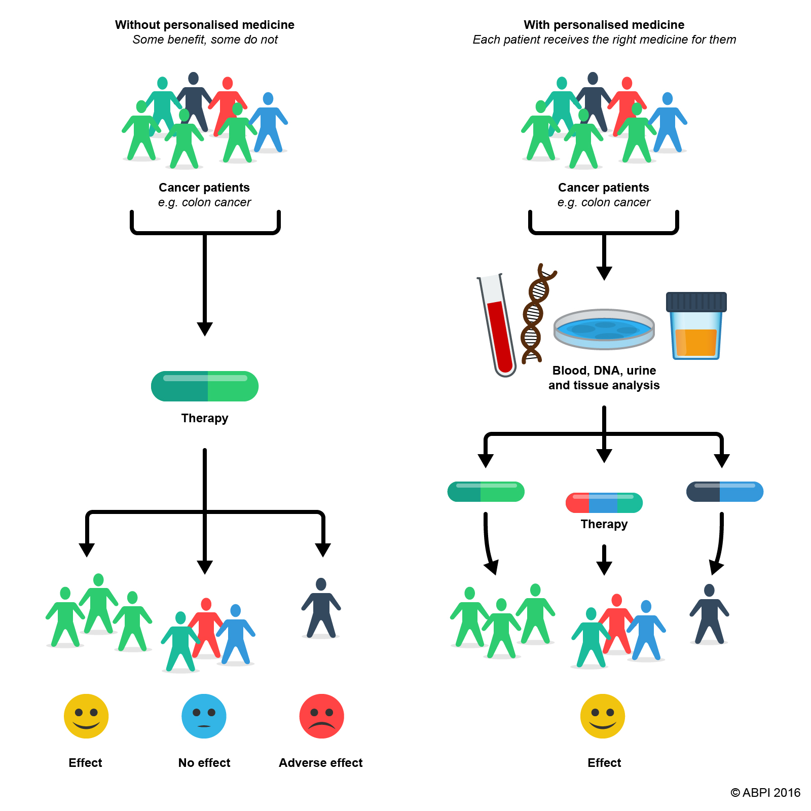
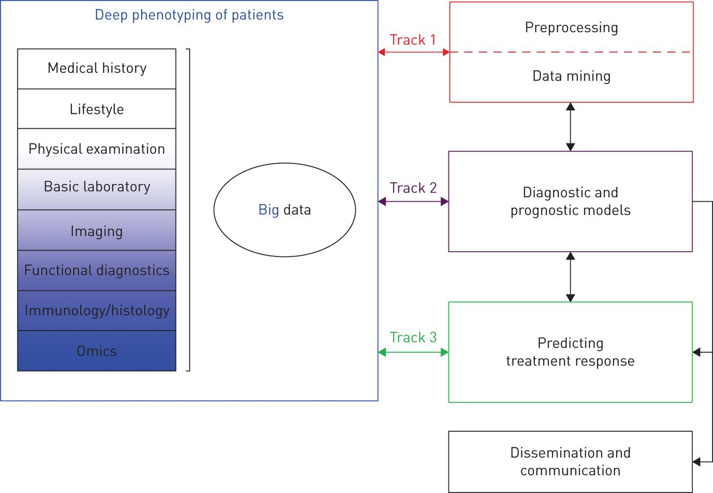
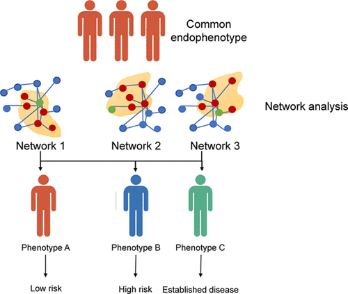
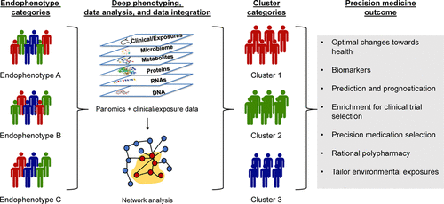
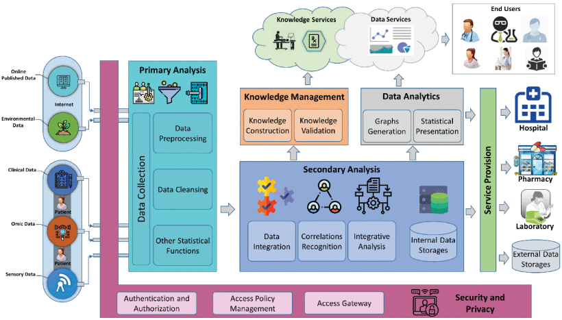
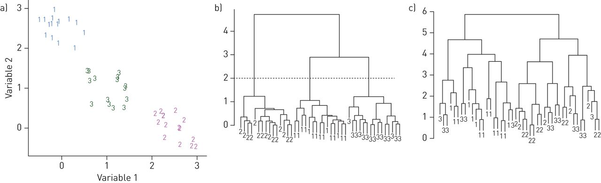
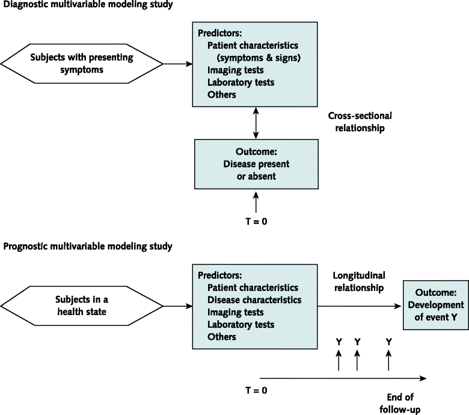
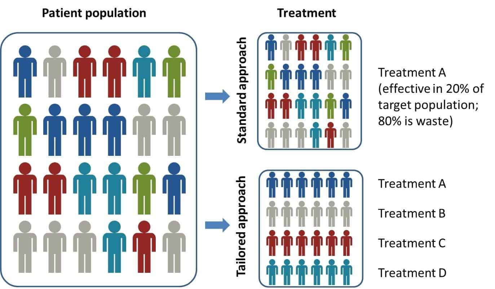
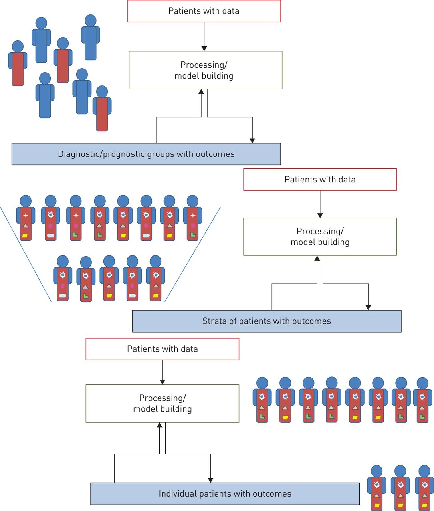

# The Process of Precision Medicine

### by Soyeon Kim, Hwayeon Lee, Meixian Wu
 
1. [What is Precision Medicine?](#1) 
	1.1. [Definition](#11) 
	1.2. [Framework of Precision Medicine Process](#12) 
2. [Deep Phenotyping](#2) 
	2.1. [Importance of Phenotype](#21) 
	2.2. [Why "Deep" Phenotyping?](#22) 
	2.3. [Processing Deep Phenotyping Data](#23) 
3. [Data Analysis](#3) 
	3.1. [Preprocessing and Data Mining](#31) 
	3.2. [Diagnostic and Prognostic Models](#32) 
	3.3. [Predicting Treatment Response](#33) 
4. [Evolving Precision Medicine](#4)
5. [Conclusion](#5)
6. [References](#6)

## 1. What is Precision Medicine?

### 1) Definition

Precision medicine is personalized treatment strategies on the basis of genetic, biomarker, phenotypic, or psychosocial characteristics to stratify patients into novel subpopulations that differ in their susceptibility to a particular disease or their response to a specific treatment. It is also commonly referred to as 'stratified medicine', 'targeted therapy', and 'deep phenotyping' [König et al.].

The primary focus is to move away from the classical 'signs-and-symptoms' approach or 'population' approach into the 'N of 1' approach in which each patient is an entire trial as a single case study from N number of individuals within a population. Figure 1 shows the difference between the two approaches with the same group of patients. A comprehensive study of such subclasses ultimately depends on computational resources to capture, store and exchange phenotypic data and upon sophisticated algorithms to integrate it with genomic variation, omics profiles, and other clinical information [Robinson].

##### Figure 1: In the left diagram, patients with colon cancer are clustered into one group and are given the same treatment, because they are treated as as a single group of population for the same symptoms. Such approach may incur negative drug responses for an individual, because it ignores individual phenotypic variation that results in different patient treatment responses and disease variability. On the right diagram, the same group is divided into seperate disease subgroups with precise and validated phenotypic recognition or a better understanding of the causal pathways. This will yield increase the likelihood of positive response to specific therapy, as stratified medical management is most likely to benefit patients. 

### 2) Framework of Precision Medicine Process

The underlying framework of precision medicine is a continous process made up of a number of feedback loops, with no steady-end point. Each cycle is an attempt to make the process more precise and make better prediction of clinical outcome. The data assessed in the patients are used to try to develop clinically relevant models, and the evolving results of these analyses then inform the need for further assessment of patients.

###### Figure 2: This diagram shows the process of precision medicine. In the deep phenotyping stage, data are gathered and forwarded to tracks 1-3, which are clinical data assessment steps. In track 1, data are handled without knowledge of clinical end-point. Specifically, data are preprocessed and explored for previously unknown structure with data mining techniques, such as clustering analysis to derive subgroup of samples. In track 2, data are used to build models to forecast clinically relevant outcomes after a number of feedback loops. Track 3 predicts treatment response and generates further knowledge about the treatment. This step also utilizes feedback to patient phenotyping results. Results from tracks 1-3 are fed back to the deep phenotyping stage for subsequent assessments.

## 2. Deep Phenotyping

### 1) Importance of Phenotype

The word phenotype can be used differently in biology versus medicine. In biology, 'phenotype' is a collection of observable physical properties of an organism, including the organism's appearance, development, behavior, and even characteristics such as gene expression profiles in response to environmental cues. In a medical context, however, 'phenotype' is a deviation from normal morphology, physiology, or behavior. When a physician makes notes of a patient's phenotype, the physician is doing so by taking a medical history, performing a physical examination, diagnostic imaging, blood tests, and other psychological tests [Robinson].

This is where precise phenotype information comes into play. As the physician makes notes of the patient's phenotypes, the physician is making a diagnosis for the patient's disease - making a hypothesis of what it may or may not be and provides a treatment that may or may not work. Making a diagnosis, therefore, is perhaps the most important task in therapy, but it is the most challenging one, especially for the cases of rare diseases, of which 8000 diseases are yet to be classified. Today, major clinical problems arise from delayed or inaccurate diagnosis, treatment, and unnecessary procedures that result in patients' psychological burdens and unnecessary expenses [Robinson]. To prevent complications and set forth effective treatments from making a correct prognosis, a full spectrum of phenotypic abnormalities is absolutely critical for improving care quality while reducing the need for unnecessary diagnostic testing and therapies [Ginsburg and Phillips]. Figure 3 shows the importance of phenotype and its molecular network underpinning. Even with the same endophenotype, risk varies between individuals because their phenotype ultimately varies at the molecular level.

##### Figure 3: Individuals with the same endophenotype, such as hypertension, can have different molecular phenotypes – resulting in different risk levels. Molecular phenotyping determines patients have different treatment responses as well.

### 2) Why "Deep" Phenotyping?

The major problem with the current phenotyping regime is unsystematic or imprecise descriptions of phenotypic descriptions in medical publications. For instance, "still walking after 25 years of onset" is definitely a phenotypic description, yet it is unclear what the physician observed in the patient as such descriptions are likely to evoke different ideas for different readers depending on personal experience and imagination. Furthermore, the current gene mutation database has very little to no phenotypic information other than the fact that the patient has that mutagen. While this information is indeed important for determining pathogenicity, it is devoid of the natural history of the disease – which is very important clinically in understanding the spectrum of complications with the disease or genotype-phenotype correlations. Deep phenotyping offers solutions for current challenges, including semantics and technical standards for phenotype and disease data. Indeed, deep phenotyping is defined as a precise and comprehensive analysis of phenotypic abnormalities in which individual components of the phenotype are observed and described. Figure 4 shows a precision medicine approach to phenotyping; even the individuals with the same endophenotype may are biologically distinct and encompass different disease profiles [Leopold and Loscalzo].

##### Figure 4: Individuals undergo a deep phenotyping process with data analysis performed using network analysis. This is deep phenotyping because individuals are classified beyond their endophenotypes. Such methodology optimizes the identification of biomarkers, clinical trials, and prognostication of disease.

### 3) Processing Deep Phenotyping Data

Conversion of deep phenotyping data into tangible therapeutic utility poses a number of challenges yet to be solved. First, computational environment for analysis of high dimensional data is required. Second, there must be data from large populations of patients as a knowledge network. The most important part, however, is the integration of the two. For example, next-generation sequencing enables genome-wide investigation of rare genetic variants, but associating these with diseases requires tailored statical tools that summarize the information of neighbored variants. Indeed, the integration of two types of different information is critical in generating the data in a clinically relevant way. To clarify this, the structure of the precision medicine process offers tracks 1-3, which are handling of the data for better prediction of drug sensitivity [König et al.].

## 3. Data Analysis

Large-scale data is integrated and converted into more precise therapeutic interventions. The analysis of deep phenotyping is distinguished into three sequential tracks: in track 1, the data are handled without knowledge of a clinical end-point; in track 2, data are used to build models for a more precise diagnosis or prognosis of disease or disease outcome; and track 3 leads to models that predict more precisely how well specific patients respond to treatment [M. Afzal et al.].

##### Figure 5: An integrated precision medicine framework for heterogeneous data collection, data analysis, knowledge management, and implementation of knowledge and data services.

### 1) Preprocessing and Data Mining

The first step of data analysis is data preprocessing. Studies on fractional exhaled nitric oxide as a marker of eosinophilic inflammation suggests that patients with asthma might be influenced by variable techniques of measurement, sampling procedures, breathing maneuvers, and different types of devices. Therefore, data are filtered and adjusted to be comparable in the analysis. Quality Control and preprocessing of the data are performed in this step [Ferté et al.].

Some common approaches for data preprocessing include:

1. Denoising and Baseline Correction

2. Missing Value Filling

3. Data Out of Range Filtration

4. Data Below the Limits of Detection Filtration

5. Variable Selection

&nbsp;

**Case Example:** Denoising + Variable selection

The collection of deep phenotyping data includes a significant amount of unselected data, which will inevitably include variables that are irrelevant for later modeling. The irrelevant variables that contain random "noise" can mask meaningful underlying relationships and structures, which is shown below.

In the figure below, forty-five individuals are clustered into three homogeneous subgroups if two variables are considered. A hierarchical cluster analysis using only these two variables identifies three clusters clearly, as shown in figure 6b. However, if three random noise variables are added to the dataset, the clustering algorithm fails to find the three groups, as indicated in figure 6c. About half of the individuals are classified incorrectly.

##### Figure 6: The illustration of an impact of variable selection 

Variable selection is important for filtering out noisy data, yet how to define noise or whether a variable is relevant remains unanswered. One important factor that guides variable selection is scientifically based a priori knowledge about the possible biologically relevant variables.

### 2) Diagnostic and Prognostic Models

After data are ready from track 1 for further training, models can be developed to estimate the risk with an absolute probability of the presence or the absence of an outcome or disease in individuals based on their clinical and non-clinical information. The prediction model can be diagnostic(outcome or disease present at this moment) or prognostic(outcome occurs within a specified time frame) [Hendriksen et al.]. 

##### Figure 7: The flow of a diagnostic multivariable modeling study

- Model Development  
Two major strategies are used to develop the models:
	1. **Full Model**  
	No predictor selection is applied. 
	Pros: avoid improper predictor selection due to predictor selection bias. 
	Cons: requires much prior knowledge to preselect the biologically relevant predictors for modeling adequately.

	2. **Variable selection**  
	**Backward Elimination** of 'redundant' predictors or **Forward Selection** of 'promising' ones. 
	The backward procedure is initialized with the full multivariable and then subsequently removes predictors based on a predefined criterion. Forward selection is when predictors are added to the multivariable model one by one. There is no agreement on the optimal method among the two methods. The choice of methods is highly content-specific [Hendriksen et al.].

- Outcome  
The outcome of a prediction aims to reflect a clinically significant and patient-relevant health state, for example, prediction on death, or presence of leukemia. In the case of the prognostic prediction model, a follow-up period is needed to be clearly defined for outcome development [Hendriksen et al.].

- Clinics-friendly Accommodation  
The regression model can be too complicated to use in daily clinical uses. Therefore, the model is usually simplified by rounding the coefficients toward integer numbers for easier scoring. However, such accommodation might negatively affect the accuracy of the model, and thus it needs to be applied carefully.

### 3) Predicting Treatment Response

After developing diagnostic and prognostic models from the previous step, there is a need for assessing variables that define a novel taxonomy with their relevance in predicting treatment response. There are two strategies to develop models that predict treatment response.

- Prediction models can be built on the diagnostic and prognostic models from the previous stage as prognostic factors may act as the natural variables to consider when developing prediction models. For instance, epidermal growth factor receptor tyrosine kinase status acts as a prognostic factor for survival in patients with non-small cell lung cancer and a predictive factor for response to the tyrosine kinase inhibitor gefitinib as first-line treatment at the same time [Riley et al.].

- The data can be directly utilized to extract significant information relevant to the prediction of the disease. For instance, in the study of asthma patients, the first clinical trials used the monoclonal anti-IL-5 antibody mepolizumab for asthma treatment. In the trial, the use of mepolizumab was associated with a significant reduction in blood and sputum eosinophils but did not have significant clinical benefit in asthma patients [Flood-Page et al.]. Consequently, in the following trials, patients with refractory eosinophilic asthma were selected and in this subgroup, mepolizumab therapy added significant clinical benefit in patients by reducing exacerbations and improving asthma quality of life scores [Haldar et al.].

##### Figure 8: The figure above is an illustration of applying different treatments, also known as "tailored medicine", to categorized groups to increase the effectiveness of treatment based on a prediction model.

This process of building prediction models involves generating further knowledge about the disease and treatment from the diagnostics and prognostics models or the data itself. The findings from this process, in the form of data, would be fed back to the phenotyping of patients to further adjust the clinical trial that could more precisely show the effectiveness of the treatment.

In addition to the feedback, dissemination and communication of the taxonomy and models with the clinical and scientific communities, for instance, to provide utilizable algorithms for clinical practices [König et al.].

## 4. Evolving Precision Medicine

##### Figure 9: The figure below shows repeated cycles of precision medicine and its subsequent outcome.

As seen in the figure, the cycle of patients assessment(deep phenotyping), data processing(preprocessing and data mining), and model building(diagnostic, prognostic, and prediction model building) is repeated at least several times to further increase the preciseness of the medicine by categorizing patient groups at a higher resolution [König et al.].

The detailed steps are as follows:

1. In the first cycles, patients are categorized into diagnostic/prognostic groups based on obvious characteristics.

2. In later cycles, more specific groups of patients are defined using more in-depth data that was obtained from the previous cycle as the data from each cycle is fed back to the next cycle of patient assessment.

3. Eventually, these feedback loops may allow the final cycles to target individual patients with specific data profiles.

## 5. Conclusion

In this paper, the process of precision medicine, starting from the deep phenotyping stage to the data analysis, which comprised preprocessing, data mining, developing diagnostic, prognostic, and prediction models, was discussed. As seen in the previous section on the continual evolution of precision medicine with the repeated cycles of the above steps, precision medicine should be viewed as the continuous process of feedback loops rather than a steady-state with an end-point or a specific output from the research. In this context, tailored or stratified medicine resulting from new stratifications can be considered as a makeshift product of the process that will generate new data for the next cycle, thus further increasing the precision.

Once again, the ultimate goal of precision medicine is the most effective treatment for the individual patient. To step closer to this goal, ongoing endeavors to be even more precise and individualistic, newly-gained scientific and clinical knowledge, and new data sources would be necessary.

## 6. References

Ferté C, Trister AD, Huang E, et al. Impact of bioinformatic procedures in the development and translation of high-throughput molecular classifiers in oncology. Clin Cancer Res 2013; **19**: 4315–4325.

Flood-Page P, Swenson C, Faiferman I, et al. A study to evaluate safety and efficacy of mepolizumab in patients with moderate persistent asthma. Am J Respir Crit Care Med 2007; 176: 1062–1071.

Ginsburg GS, Phillips KA. Precision Medicine: From Science To Value. Health Aff (Millwood). 2018 May;37(5):694-701. doi: 10.1377/hlthaff.2017.1624. PMID: 29733705; PMCID: PMC5989714.

Haldar P, Brightling CE, Hargadon B, et al. Mepolizumab and exacerbations of refractory eosinophilic asthma. N Engl J Med 2009; 360: 973–984.

Hendriksen JMT, Geersing GJ, Moons KGM, de Groot JAH. Diagnostic and prognostic prediction models. J Thromb Hae- most 2013; 11 (Suppl. 1): 129–41.

Inke R. König, Oliver Fuchs, Gesine Hansen, Erika von Mutius, Matthias V. Kopp European Respiratory Journal Oct 2017, 50 (4) 1700391; DOI: 10.1183/13993003.00391-2017

Leopold JA, Loscalzo J. Emerging Role of Precision Medicine in Cardiovascular Disease. Circ Res. 2018;122(9):1302-1315. doi:10.1161/CIRCRESAHA.117.310782

M. Afzal, S. M. Riazul Islam, M. Hussain and S. Lee, "Precision Medicine Informatics: Principles, Prospects, and Challenges," in IEEE Access, vol. 8, pp. 13593-13612, 2020, doi: 10.1109/ACCESS.2020.2965955.

National Research Council, Committee on A Framework for Developing a New Taxonomy of Disease. Toward Precision Medicine: Building a Knowledge Network for Biomedical Research and a New Taxonomy of Disease. National Academies Press; Washington DC: 2011.

Riley RD, Hayden JA, Steyerberg EW, et al. Prognosis Research Strategy (PROGRESS) 2: prognostic factor research. PLoS Med 2013; 10: e1001380.

Robinson PN. Deep phenotyping for precision medicine. Hum Mutat. 2012 May;33(5):777-80. doi: 10.1002/humu.22080. PMID: 22504886.

"What Is Precision Medicine and How Can It Help Fix Healthcare." ReferralMD, ReferralMD, 11 Dec. 2018, getreferralmd.com/2018/02/precision-medicine-can-help-fix-healthcare/.
