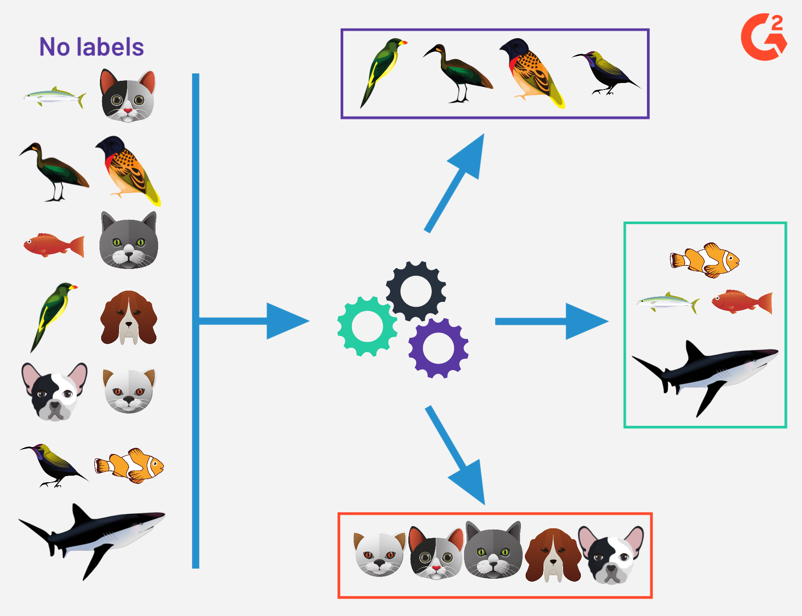
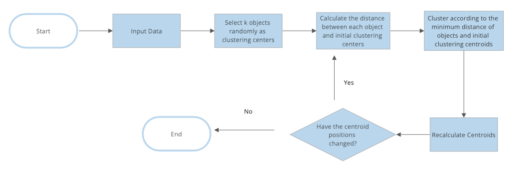

# Introduction to K-Means Clustering
### By Shruti Shirsathe, Min-Son Tran, and Lily Steiner
## Overview

k-Means Clustering is a topic that falls under Machine Learning. To give some context, there are different types of machine learning algorithms such as:
**Supervised Machine Learning**
**Unsupervised Machine Learning**
**Semi-Supervised Machine Learning**
**Reinforcement Learning**

The two main types, Supervised and Unsupervised Machine Learning are defined as the following:
* Supervised: Algorithm that requires an input of data, and labels for classification. In the end, it is used to make predictions and classify data.
* Unsupervised: Algorithm that requires only an input of data and no labels. It is used to understand the relationships between points in the dataset.

[1] In this image, the input data includes information with different animals without any labels for what they are; the unsupervised algorithm takes this input and groups the data into 3 different clusters based on how closely the data is related to one another

K-Means clustering is an unsupervised algorithm, meaning that the goal is to look for patterns in a dataset without pre-existing labels. 
Applications are to either:
1. confirm any assumptions about the types of groups that exist in the data
2. identify unknown groups in the data

* * *

## The Algorithm

1. Choose a value K as the number of cluster centers and set the cluster centers randomly. One way to choose K is by using the elbow method
2. Perform K-means clustering with different values of K. For each k, we calculate average distances to the centroid across all data points.
3. Plot these points and find the point where the average distance from the centroid falls suddenly (“Elbow”)
4. Now that we chose k and the initial centroids are chosen, we then 
calculate the distances between all the points in the data and the centroids, then group the points with the cluster center they are closest to.
5. Now we recalculate the centroid of these new clusters by finding the new center of gravity of the clusters; then group the data points to the new nearest centroid as we did before. 
6. We then repeat these steps until the centroid positions remain the same; if so, the algorithm has completed and you’ve found your clusters.
