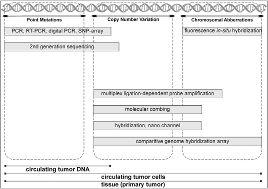
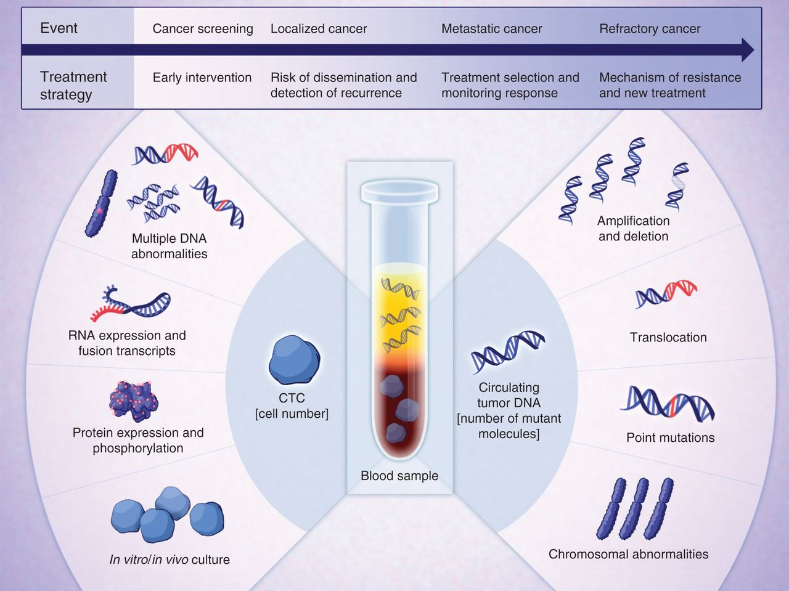
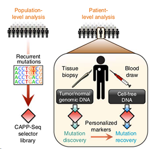
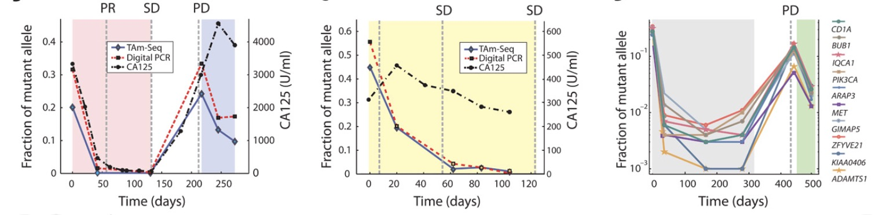

# Using Targeted Sequencing to Further Cancer Diagnostics
By - Ishan Goyal (A12094992)

1. [Abstract](#1) 
2. [Introduction](#2) 
	a. [Liquid Biopsy vs Tissue Biopsy](#21) 
	b. [Circulating Tumor Cells vs Circulating Tumor DNA](#22) 
3. [Overivew of Methods](#3) 
	a. [Whole Genome Sequencing](#31) 
	b. [Whole Exome Sequencing](#32) 
	c. [CAPP-Seq](#33) 
	d. [TAm-Seq](#34) 
4. [Applications & Future Use](#4) 
5. [Data Tables & Figures](#5) 

## Abstract 

The field of cancer diagnostics has experienced tremendous growth and technical developments over the past decade. The advent of high throughoupt sequencing technologies coupled with high-specificity screening methods is enabling the discovery of new biomarkers and potential early disease diagnosis of patients. [1] With early diagnosis comes a variety of benefits for the patient including increased treatment options and higher overall survival rate. For colon cancer ,there is a 91% 5-year survival rate when diagnosed early versus only 11% survival rate if it is caught late and has spread to other organs. [7] Unfortunately, current diagnosis options such as tissue biopsies, endoscopy, or radiology are often invasive, expensive, and involve long procedures to patients. In addition, tissue biopsies only provide a snapshot of the mutations in a patient rather than a global picture of the patient's predisposition to a disease.

In this chapter, we will be introducing the use of sequencing technologies to analyze liquid biopsy based cancer samples. Early studies in 1977 revealed a high level of cell free DNA and circulating tumor DNA in cancer patient plasma. Liquid biopsy based diagnostics hope to solve the invasive and costly drawbacks of tissue biopsy while serving as a highly specific predictor of cancer. Liquid biopsy aims to detect cancer mutations within the plasma, provide early screening options for these mutations, and monitor these mutations over time to assess tumor burden and treatment effectiveness.

## Introduction 

#### Liquid Biopsy vs Tissue Biopsy:   
In recent years, the personalized or stratified management of patients with advanced non small-cell lung cancer (NSCLC) has allowed for the comparison of liquid and tissue biopsy techniques. While tissue biopsy is the conventional approach, it has been discovered that tumors often display heterogeneity between different regions in the same tumor as well as with distal tumors in the patient. [4] This heterogeneity presents a challenge because it limits tissue biopsy to a mere snapshot of the entire tumor profile. In addition, patients with NSCLC are often not in the condition to undergo complex biopsy procedures that are required to extract adequate tissue samples. Lastly, the turn around times on these procedures and costs can pose immense burden to the patient.

In contrast, liquid biopsy is showing great promise through the analysis of tumor material within patient blood samples. A variety of nucleic acids such as circulating cell-free DNA and cell-free RNA are often released from apoptotic and necrotic tumor cells into the bloodstream. The mutation profiles of these nucleic acids can be analyzed using sequencing technologies to give a more holistic snapshot of a patients tumor and mutation progression. It takes approximately 50 million malignant cells to release sufficient DNA for the detection of circular tumor specific DNA in the blood. In contrast, current positron emission topography techniques for biopsy analysis can detect tumors of length no less than 7-10 mm in size. This equates to roughly 1 billion malignant cells in contrast to the 50 million required for liquid biopsy identification. The advanced sensitivity and financial feasibility of liquid biopsy approaches hope to further the cancer diagnostics field and soon replace traditional tissue biopsy. [4]

  
[Figure 1](https://www.sciencedirect.com/science/article/pii/S2001037018300060#s0030).
**Comparison of the types of mutations and analysis that can be conducted with tissue & liquid based biopsy techniques.**

#### Circulating Tumor Cells vs Circulating Tumor DNA:   

Circulating Tumor Cells (CTCs): CTC's are tumor cells that have spread from tumors via blood or lymphatic vessels. The presence of CTC's in lung cancer patients has been reported as a known factor in disease metastasis and outgrowth. The key challenge with CTC's is their detection as they require extreme levels of sensitivity to observe. One enrichment technique, CellSearch, has been approved by the FDA for monitoring metastatic breast cancer, castration-resistant prostate cancer, and color cancer. [2] In clinical practice, it has been noticed that the overall survival of patients who had stable CTC counts in their blood after treatment was significantly worse.

Circulating Tumor DNA (ctDNA): ctDNA is hypothesized to enter the bloodstream either passively through apoptotic and necrotic tumor cells or actively by living tumor cells that are targeting recipient cells at distal locations. Detection of ctDNA, similar to CTC's, is challenging as it is a small percentage of all cell free DNA. Using PCR and advanced NGS technologies, it is possible to identify low concentrations of ctDNA within patient plasma samples. Additional methods will be discussed below that help improve the sensitivity of NGS ctDNA sample analysis. [2] In the clinical setting, ctDNA can be used for early diagnosis/response prediction and to characterize molecular tumor alterations. It has been noted in many studies that the ctDNA concentration often spikes during patient relapse. Overall, both CTC and ctDNA analysis coupled with sequencing methodologies can yield novel insights on tumor growth and patient specific mutations.

  
[Figure 2](http://cancerdiscovery.aacrjournals.org/content/4/6/650).
**CTC and ctDNA analysis can yield information on the tumor progression and mutation profile.**

## Overview of Methods 

#### Whole Genome Sequencing (WGS): 
WGS is used as an initial step in the bioinformatics pipeline to get an understanding of the patient's genome wide cancer profile. WGS provides insights into genomic loci that are mutation hotspots and can help inform further probe design. Within plasma DNA, WGS has been used to detect copy number variation (CNV), but does not have the resolution to detect SNV's or allele frequencies. WGS approaches are also more prone to higher ratio of intronic or passenger mutations compared to a targeted approach. [5]

#### Whole Exome Sequencing (WES): 
WES makes possible the routine analysis of de novo mutations in plasma samples by comparing samples prior to and in response to therapy. A proof of concept experiment with WES involved collecting plasma samples at the beginning of treatment and at the time of relapse. WES approach here allows more in-depth understanding of multiple regions that may be differentially expressed. This approach is also less sensitive to copy number variation challenges and is more cost effective than WGS. [5]

#### CAPP-Seq:
Cancer Personalized Profiling by Deep Sequencing (CAPP-Seq) is a highly sensititve and economical method to quantify ctDNA. In general, ctDNA levels are highly correlated with tumor volume and can provide earlier treatment response assessment compared to radiographic approaches. In non-small cell lung cancer patients, ctDNA was detected in 100% of stage II-IV tumors and 50% of stage I tumors. The CAPP-Seq technique requires designing a "selector" of biotinylated DNA oligonucleotides that target recurrently mutated regions in the cancer of interest. The selector panel is often optimized using WES data and other intron breakpoints to best span the mutated areas. CAPP-Seq can be further applied to disease stage monitoring as it can predict tumor stage progression via ctDNA analysis with a relatively high degree of sensitivity and specificity. [6]

Experimentally, it is possible to use CAPP-Seq across different time points to understand how the allele frequencies of different mutations are changing in response to treatment. This approach requires analyzing both ctDNA and germline DNA as a baseline to compare the variants. Mutations that tend to increase in frequency may be experiencing selective pressure and targeting these mutations can signficantly reduce disease progression. [6]

CAPP-Seq Workflow:  
 
[Figure 4](https://www.ncbi.nlm.nih.gov/pmc/articles/PMC4016134/figure/F1/). 
**Population level analysis is conducted to identify a set of selector regions for CAPP-Seq. Both tissue and liquid biopsy sample are analyzed to identify and validate personalized cancer markers.**

#### TAm-Seq:
TAm-Seq is a method for tagged-amplicon deep sequencing that allows for the identification of cancer mutations in circulating DNA present at allele frequencies as low as 2%. With a sensitivity and specificity of over 97%, TAm-Seq can be used to monitor tumor dynamics, track mutations, and identify the origin of relapse in a patient with multiple primary tumors. The prototypic example is where the allele frequencies of 10 different mutations in a patient with metastatic breast cancer all sharply decline upon onset of the chemotherapy, but increase after termination of the therapy. By monitoring the AF of common mutations amongst patients with different disease subsets, it may be possible to generate more personalized treatment options. [3] The image below shows the progression of a disease at various time points where the allele frequencies are being measured by TAm-Seq. PR indicates partial response, SD is stable disease, and PD is progressive disease.

TAm-Seq Workflow:
 
[Figure 5](http://stm.sciencemag.org/content/scitransmed/4/136/136ra68/F4.large.jpg).
**The allele frequencies of mutations in breast cancer patients are monitored to view their relationship with time and treatment.**

The TAm-Seq method uses a combination of short amplicons, two-step amplification, sample barcode sequences, and high-throughput PCR. Because the amplicons are short, TAm-Seq effectively amplifies even small amounts of fragmented DNA such as are present in circulating DNA. PCR primers are used to cover regions of interest that are identified through prior WGS and WES along with population level analysis. The regions are amplified in a two step process. They are first amplified in parallel to preserve the allele representation. They are then selectively re-amplified along the regions of choice (single-plex). Lastly, sequence specific adaptors are added to these amplicons to allow for pooling and sequencing. Preparing TAm-Seq libraries for sequencing from 48 samples takes less than 24 hours and involves only few hours of hands-on time. New platforms for massively parallel sequencing allow for fast turnaround times, which make this approach practical in a clinical setting. [3]

## Applications & Future Use  

The cancer diagnostics industry is expected to reach a net worth of approximately 232.7 billion USD by 2025. The market of individuals who could benefit from more accurate diagnostics increases annually as the National Cancer Institute estimates approximately 14 million new cases a year. There are a variety of companies developing technologies to further cancer diagnostics. GRAIL uses high through-put sequencing to understand cancer causing mutations while Freenome uses machine learning to predict immune response that are results of cancer development. 

## Data Tables & Figures  

#### Comparison of WGS, WES, & Targeted Sequencing
<table>
 <tbody>
    <tr>
        <th>Attribute / Parameter </td>
        <th>Whole Genome Sequencing (WGS) </td>
        <th>Whole Exome Sequencing (WES)</td>
        <th>Targeted Sequencing</td>
    </tr>
    <tr>
        <td> Information Level </td>
        <td> Everything </td>
        <td> Genes </td>
        <td> User Defined </td>
    </tr>
    <tr>
        <td> Cost Per Sample </td>
        <td> $5000 </td>
        <td> $2000 </td>
        <td> $200 </td>
    </tr>
    <tr>
        <td> Low Frequency Mutation Detection </td>
        <td> Not Possible </td>
        <td> Not Likely </td>
        <td> Yes </td>
    </tr>
    <tr>
        <td> DNA Input Amount </td>
        <td> 1 ug </td>
        <td> 100 - 200 ng </td>
        <td> 10 ng </td>
    </tr>
    <tr>
        <td> # of Samples in Parallel </td>
        <td> 1 </td>
        <td> 2 </td>
        <td> 96 </td>
    </tr>
 </tbody>
</table>
 

The ability to detect low frequency mutations is specific to targeted sequencing. Unlike WGS and WES, targeted sequencing is relatively inexpensive, can be run in parellel up to 96x and doesn't require high levels of DNA input.

## References  
[1] “Biomarkers.” Canary Foundation, www.canaryfoundation.org/canary-science/science/biomarkers/.  

[2] Calabuig-Fariñas, Silvia, and Carlos Camps. “Circulating Tumor Cells versus Circulating Tumor DNA in Lung Cancer-Which One Will Win?” Translational Lung Cancer Research, 5 Oct. 2016, tlcr.amegroups.com/article/view/10106/8669.

[3] Forshew, Tim. “Noninvasive Identification and Monitoring of Cancer Mutations by Targeted Deep Sequencing of Plasma DNA.” Science Translational Medicine, American Association for the Advancement of Science, 30 May 2012, stm.sciencemag.org/content/4/136/136ra68.long. 

[4] Ilie, Marius, and Paul Hofman. “Pros: Can Tissue Biopsy Be Replaced by Liquid Biopsy?” Translational Lung Cancer Research, Aug. 2016, tlcr.amegroups.com/article/view/8950/8064.

[5] Ma, Mingwei, and Gang Chen. “‘Liquid Biopsy’-CtDNA Detection with Great Potential and Challenges.” Annals of Translational Medicine, Sept. 2015, atm.amegroups.com/article/view/7851/8632.

[6] Newman, Aaron M, and Maximilian Diehn. “An Ultrasensitive Method for Quantitating Circulating Tumor DNA with Broad Patient Coverage.” Nature News, Nature Publishing Group, 6 Apr. 2014, www.nature.com/articles/nm.3519.

[7] “Understanding Statistics Used to Guide Prognosis and Evaluate Treatment.” Cancer.Net, 11 Aug. 2018, www.cancer.net/navigating-cancer-care/cancer-basics/understanding-statistics-used-guide-prognosis-and-evaluate-treatment. 

